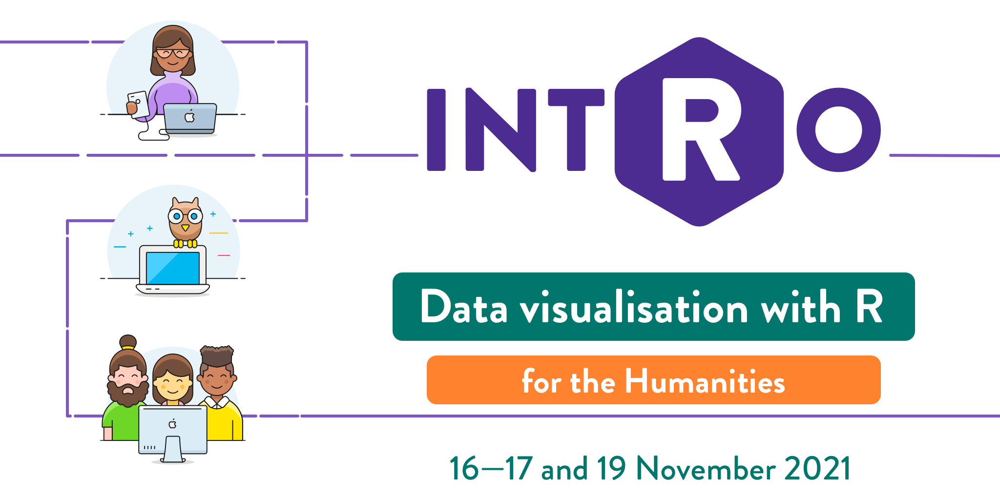
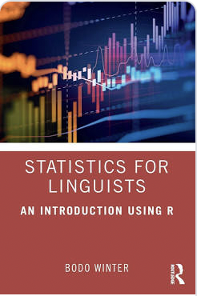
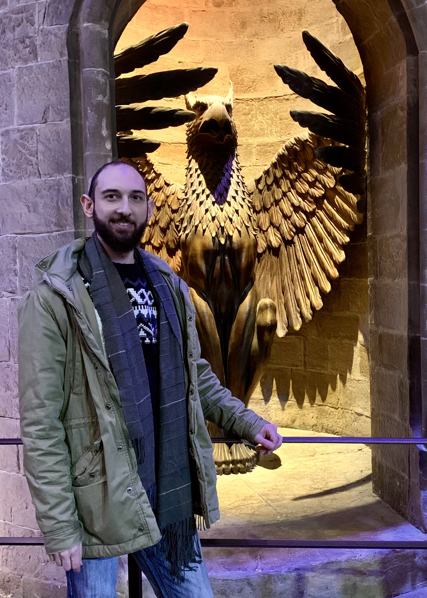

```{r setup, include=FALSE}
options(htmltools.dir.version = FALSE)
library(tidyverse)
theme_set(theme_dark())
library(xaringanExtra)
use_xaringan_extra(c("panelset", "tachyons"))
```

.fl.w-30.pa2[.f1[<br><br>**The research process**]]
.fl.w-60.pa2[.center[

]]

???

From <https://www.futurelearn.com/info/courses/research-process/0/steps/71889>

---

.fl.w-30.pa2[.f1[<br><br>**The research process**]]
.fl.w-60.pa2[.center[

]]

---

.pull-left[
.f1[<br> 
<br>
**DATA ANALYSIS**<br>]

(*includes statistics*)

]

.pull-right[.center[

]]

???

Photo by <a href="https://unsplash.com/@sleblanc01?utm_source=unsplash&utm_medium=referral&utm_content=creditCopyText">Stephanie LeBlanc</a> on <a href="https://unsplash.com/s/photos/ant?utm_source=unsplash&utm_medium=referral&utm_content=creditCopyText">Unsplash</a>

---

background-image: url(../img/data-viz-model.png)
background-size: contain

---

class: bottom
background-image: url(../img/marvin-esteve-4y8A6Ve-3GE-unsplash.jpg)
background-size: cover

.white.f1[**Think about the analysis<br>*while planning your experimental design***]

<br>

???

Photo by <a href="https://unsplash.com/@tme18?utm_source=unsplash&utm_medium=referral&utm_content=creditCopyText">Marvin Esteve</a> on <a href="https://unsplash.com/s/photos/warning?utm_source=unsplash&utm_medium=referral&utm_content=creditCopyText">Unsplash</a>

---

# Which language area(s) will your dissertation be on?

---

# Resources (absolute beginners)




---

# Resources (beginners-intermediate)


.pull-left[
.center[]
]

.pull-right[
<https://r4ds.had.co.nz>

> You’ll learn how to get your data into R, get it into the most useful structure, transform it, visualise it and model it.

<br>

Ch 1-8 and Ch 11.

]

---

# Resources (intermediate-advanced)

<br>

.green.f2[**Crash course on linear models**]

- 3 hours sometime in **late Spring**.

- Basic knowledge of R will be **required** (intRo, R4DS).

- More info in Semester 2.


???

Photo by <a href="https://unsplash.com/@mariolagr?utm_source=unsplash&utm_medium=referral&utm_content=creditCopyText">MARIOLA GROBELSKA</a> on <a href="https://unsplash.com/s/photos/shinkansen?utm_source=unsplash&utm_medium=referral&utm_content=creditCopyText">Unsplash</a>

---

# Resources (from beginners to advanced)

.pull-left[
.center[

]
]

.pull-right[
Excellent **beginners textbook** for linguistics students.

What I like about it:

- It uses R.
- There's very little maths in it.
- It teaches one thing (linear models) and it does it well.
- It has a fresh take on research.
- It's available as an ebook through the library.
]

---

# Resources

<https://uoe.sharepoint.com/sites/PPLSLearningResources>

Research > Data analysis > *Support for dissertation writers*

.center[]

---

# Resources

.pull-left[
.center[]
]

.pull-right[
.f1[**Me!**]

You can reach me here:

- s.coretta@ed.ac.uk

- DSB 2.14

<br>

<br>

.f5[Me about to meet with Professor Dumbledore.]
]

---

# Which type of data will you need for your dissertation?

---

class: center middle inverse

# QUESTIONS?

---

background-image: url(../img/niklas-hamann-kFitVFGVDo4-unsplash.jpg)
background-size: cover

???

Photo by <a href="https://unsplash.com/@niklas_hamann?utm_source=unsplash&utm_medium=referral&utm_content=creditCopyText">Niklas Hamann</a> on <a href="https://unsplash.com/s/photos/beaver?utm_source=unsplash&utm_medium=referral&utm_content=creditCopyText">Unsplash</a>
