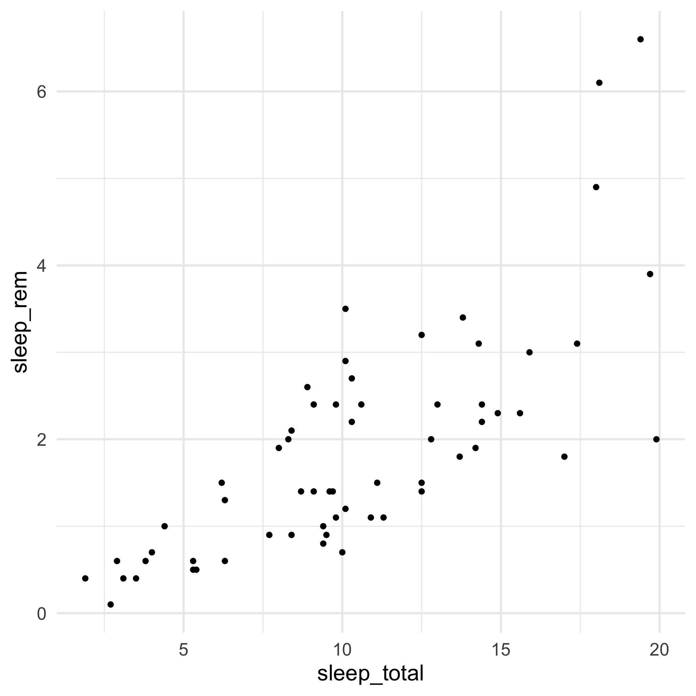
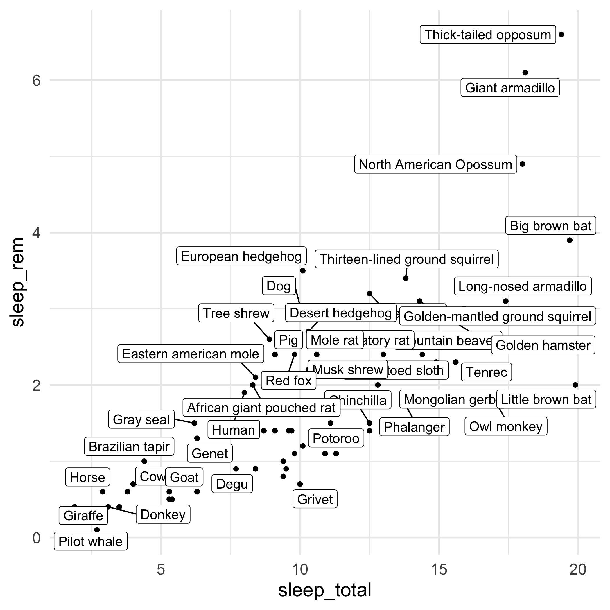
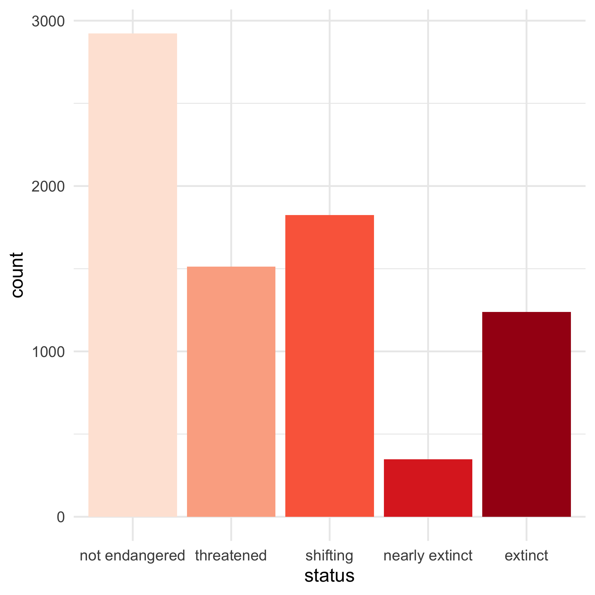
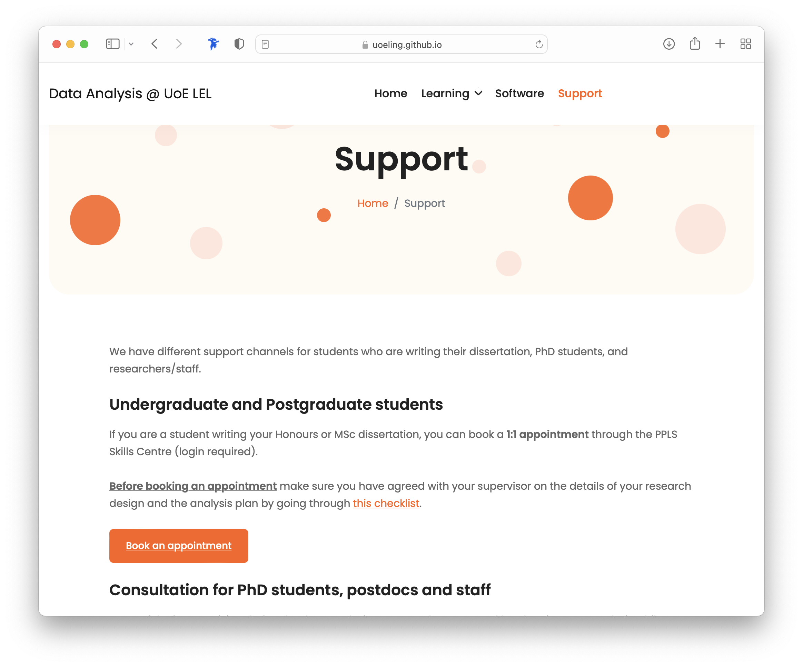

```{r setup, include=FALSE}
options(htmltools.dir.version = FALSE)
library(tidyverse)
theme_set(theme_dark())
library(xaringanExtra)
use_xaringan_extra(c("panelset", "tachyons"))
```

background-image: url(../img/data-sum-viz-model.png)
background-size: contain

---

# Summarise

<br>
<br>

.pull-left[
**Measures of central tendency**

* Mean = `mean()`

* Median = `median()`

* Mode = `table()` + pick the most common value

]

--

.pull-right[
**Measures of dispersion**

* Range (minimum, maximum) = `range()`, `min()`, `max()`

* Standard deviation = `sd()`

]

---

# Visualise

.center[

]

---

# Visualise

.center[

]

---

# Visualise

.center[

]

---

# Visualise

.center[

]

???

https://www.cedricscherer.com/2019/05/17/the-evolution-of-a-ggplot-ep.-1/#code

---

# Visualise

.center[

]

---

# Visualise

.center[

]

---

# Visualise

<br>
<br>

## Resources

- [Data viz catalogue](https://datavizcatalogue.com/index.html)

- [Top 50 ggplot2 visualisations](http://r-statistics.co/Top50-Ggplot2-Visualizations-MasterList-R-Code.html)

- [Data Viz online class](https://datavizm20.classes.andrewheiss.com/)

- [Raincloud plots](https://wellcomeopenresearch.org/articles/4-63)

---

# Model

.bg-washed-blue.b--dark-blue.ba.bw2.br3.shadow-5.ph4.mt5[
Most likely, you will be able to use some kind of **linear model**.

* [Linear models: a cheat sheet](https://stefanocoretta.github.io/post/2021-08-21-regression-models-a-cheat-sheet/).
]

--

.bg-washed-blue.b--dark-blue.ba.bw2.br3.shadow-5.ph4.mt5[
<!-- Carefully think about your data analysis (especially modelling) <u>**while**</u> thinking about the research question/hypothesis. -->

Carefully think about your data analysis (especially modelling).

* [Analysis plan checklist](https://uoeling.github.io/analysis-checklist/).
* [How to simplify your study design](https://stefanocoretta.github.io/post/2021-12-01-how-to-simplify-your-study-design/).
]

---

# <https://uoeling.github.io>

.center[

]

---

# <https://uoeling.github.io>

.center[

]

---

class: center middle inverse

# .f1[Questions?]
