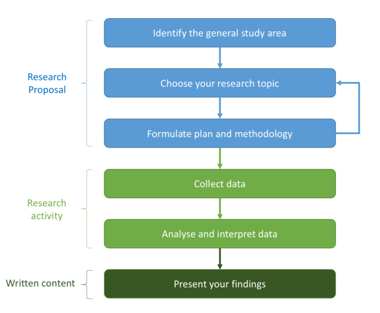
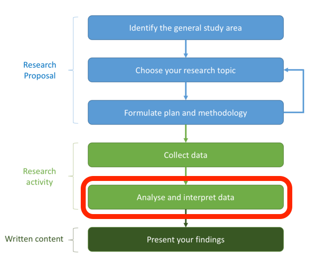
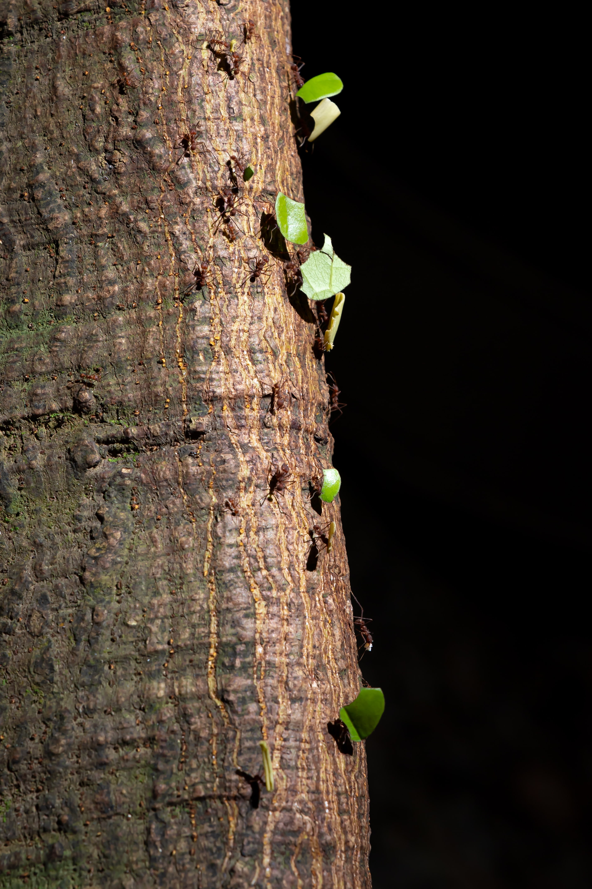

```{r setup, include=FALSE}
options(htmltools.dir.version = FALSE)
library(tidyverse)
theme_set(theme_dark())
library(xaringanExtra)
use_xaringan_extra(c("panelset", "tachyons"))
```

.fl.w-30.pa2[.f1[<br><br>**The research process**]]
.fl.w-60.pa2[.center[

]]

???

From <https://www.futurelearn.com/info/courses/research-process/0/steps/71889>

---

.fl.w-30.pa2[.f1[<br><br>**The research process**]]
.fl.w-60.pa2[.center[

]]

---

.pull-left[
.f1[<br> 
<br>
**DATA ANALYSIS**<br>]

(*includes statistics*)

]

.pull-right[.center[

]]

???

Photo by <a href="https://unsplash.com/@sleblanc01?utm_source=unsplash&utm_medium=referral&utm_content=creditCopyText">Stephanie LeBlanc</a> on <a href="https://unsplash.com/s/photos/ant?utm_source=unsplash&utm_medium=referral&utm_content=creditCopyText">Unsplash</a>

---

Photo by <a href="https://unsplash.com/@niklas_hamann?utm_source=unsplash&utm_medium=referral&utm_content=creditCopyText">Niklas Hamann</a> on <a href="https://unsplash.com/s/photos/beaver?utm_source=unsplash&utm_medium=referral&utm_content=creditCopyText">Unsplash</a>
